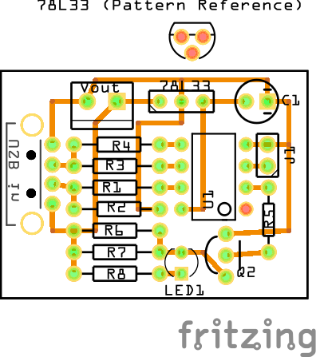

# ATTiny13 Quick Charge 2.0 Powerbank Adapter Board
A small adapter board which emulates a Quick Charge 2.0 (also compatible with Quick Charge 3.0) compatible device to force a power supply or a power bank to output higher voltages. Additionally this board generates a base load to prevent power banks from switching off automatically, if there is not enough load on the output.

# Quick Charge 2.0 specification
To trigger the Quick Charge feature a special init routine must be run through. I have tried this routine from different sources (which are linked down below) but all of them did not work with all my Quick Charge power supplies. So I tried to create my own routine, which was inspired by the instructions given in the TPS61088 datasheet (Page 6+7). This routine works just fine with all my Quick Charge power supplies.

After this initialization the output Voltage can be configured by applying different voltage levels to the USB data lines D+ and D-:

## Voltage Levels:
| D+        | D-        | output voltage    |
| --------  | --------  | --------          |
| 0,6V      | 0,0V      |  5V (default)     |
| 3,3V      | 0,6V      |  9V               |
| 0,6V      | 0,6V      | 12V               |

With this board the output voltage can be configured BEFORE startup using a jumper. The output configuration is shown by the LED attached in parallel to the load resistors:
- Jumper is set during startup: output 9V, LED flashes 2 times each cycle
- Jumper is not set during startup: output 12V, LED flashes 1 time each cycle

# Hardware
## Schematic

## PCB Layout

## ATtiny-Pinout

 (Source: https://cdn.sparkfun.com/assets/f/8/f/d/9/52713d5b757b7fc0658b4567.png)

# Software

## Program the ATtiny
### 1. Upload `ArduinoISP` sketch to the Arduino
   You can find it in the Examples folder of the Arduino-IDE

### 2. wiring
   I use a Arduino Nano to program the ATtiny, but also a Arduino UNO will do fine. Hook up the ATtiny like it is shown in the schematic:

   

   The capacitor is important because it prevents the Arduino from resetting itself while programming the ATtiny.

### 3. Download ATtiny13 support for the IDE
   Add the URL `http://drazzy.com/package_drazzy.com_index.json` to the Additional Boards Manager URLs in the IDE Preferences. After that open the Boards-Manager, search for "DIY Attiny" and install it. Now you should find the Attiny13 and some other Attiny Boards in the Board menu.

### 4. Uploading
  Open the code in the Arduino IDE and select the Attiny13 as the Board.
  Select the following settings:
   
  
  It is important to set "Arduino as ISP" (**NOT Arduino ISP**) as the programmer. 
   
   **After that Press `Burn Bootloader` to make sure that these Settings are applied.**

   Now you can upload the code by simply pressing **Upload**.

# Sources
- For the init routine: TPS61088 datasheet (Page 6+7) https://www.ti.com/lit/ug/tidu917/tidu917.pdf
- Voltages levels to configure the output: https://www.mouser.com/datasheet/2/328/chiphy_family_datasheet-269468.pdf
- USB pinout: https://www.electroschematics.com/wp-content/uploads/2010/01/usb-pinout.jpg
- other tested init routine + schematic inspiration: https://create.arduino.cc/projecthub/PSoC_Rocks/hacking-qualcomm-quick-charge-qc-2-0-3-0-with-attiny85-b7627d
- other tested init routine: https://github.com/septillion-git/QC2Control

 

### I hope you like this project!

 

This work by Dustin Brunner is licensed under <a rel="license" href="https://creativecommons.org/licenses/by/4.0">CC BY 4.0</a>

 Dieses Werk von Dustin Brunner ist lizenziert unter einer <a rel="license" href="http://creativecommons.org/licenses/by/4.0/">Creative Commons Namensnennung 4.0 International Lizenz</a>.